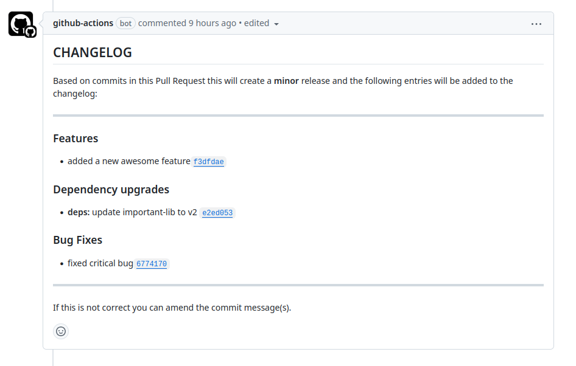

# pull-request-changelog

Add a sticky comment to a pull request with the changelog entries for the new commits.

Features:

- [Github action](https://github.com/marketplace/actions/pull-requst-changelog) for easy integration with Github.
- CLI and API for custom usage.
- Supports both Conventional Changelog presets or a custom configuration.
- Works with Semantic Release



## Usage with Github Actions (recommended)

Create a workflow with these steps:

```yaml
- name: Checkout
  uses: actions/checkout@v4
- name: Setup Node.js
  uses: actions/setup-node@v4
  with:
    node-version: 22.x
- name: Pull Requst Changelog
  uses: ext/pull-request-changelog@master
```

> [!NOTE]
> Node 22.x or later is required, make sure to specify `node-version`!

### Configuration

The following input parameters are provided, which can be passed to the `with` parameter.
All parameters are optional.

<!-- ACTION INPUTS BEGIN -->

<!-- prettier-ignore -->
Input&nbsp;parameter | Default | Description
--- | --- | ---
preset |  | full name of an NPM package with a conventional changelog preset
config |  | path to a configuration file exporting a configuration
template-dir |  | directory with templates
filename | "pr-changelog.md" | name of temporary file generated by script
comment | true | If `true` a sticky comment will be added with the changelog.
comment-id | "pull-request-changelog" | id passed to sticky-pull-request-commend
fetch-depth | 100 | git commit depth
version | "auto" | NPM script version (passed to npx). Default is to use same script version as action version.

<!-- ACTION INPUTS END -->

## Usage with CLI

```bash
npx pull-request-changelog \
  --preset conventional-changelog-conventionalcommits \
  --from origin/main \
  --to HEAD
```

Do note that the full name of the preset must be specified, this is different to how `conventional-changelog-cli` handles `-p`.

<!-- CLI USAGE BEGIN -->

```plaintext
Generate changelog from conventional changelog for using in a pull request comment.

Usage
  $ npx pull-request-changelog -f origin/main

Options
  --from, -f          Base branch/ref
  --to, -t            Pull request branch/ref (default: HEAD)
  --preset, -p        Conventional Changelog preset (NPM package)
  --config, -c        Conventional Changelog config (filename)
  --output, -o        Output file (default stdout)
  --template-dir, -T  Template directory

Other
  --help      Show usage
  --version   Show version

The template directory may contain the files:

- message.hbs for the main template
- header.hbs for the header partial
- footer.hbs for the footer partial
```

<!-- CLI USAGE END -->

If you need to customize the configuration for the conventional-changelog preset create a new file default exporting a function wrapping the preset and use `--config` instead:

```ts
import conventionalChangelogConventionalcommits from "conventionallchangelog-conventionalcommits";

export default () => {
  return conventionalChangelogConventionalcommits({
    /* preset configuration */
  });
};
```

```diff
 npx pull-request-changelog \
-  --preset conventional-changelog-conventionalcommits \
+  --config my-config.mjs \
   --from origin/main \
   --to HEAD
```

## Usage with API

```ts
import { pullRequestChangelog } from "pull-request-changelog";
import conventionalChangelogConventionalcommits from "conventionallchangelog-conventionalcommits";

const markdown = await pullRequestChangelog({
  config: conventionalChangelogConventionalcommits({
    /* preset configuration */
  }),
  git: {
    from: "origin/main",
    to: "HEAD",
  },
});
```
